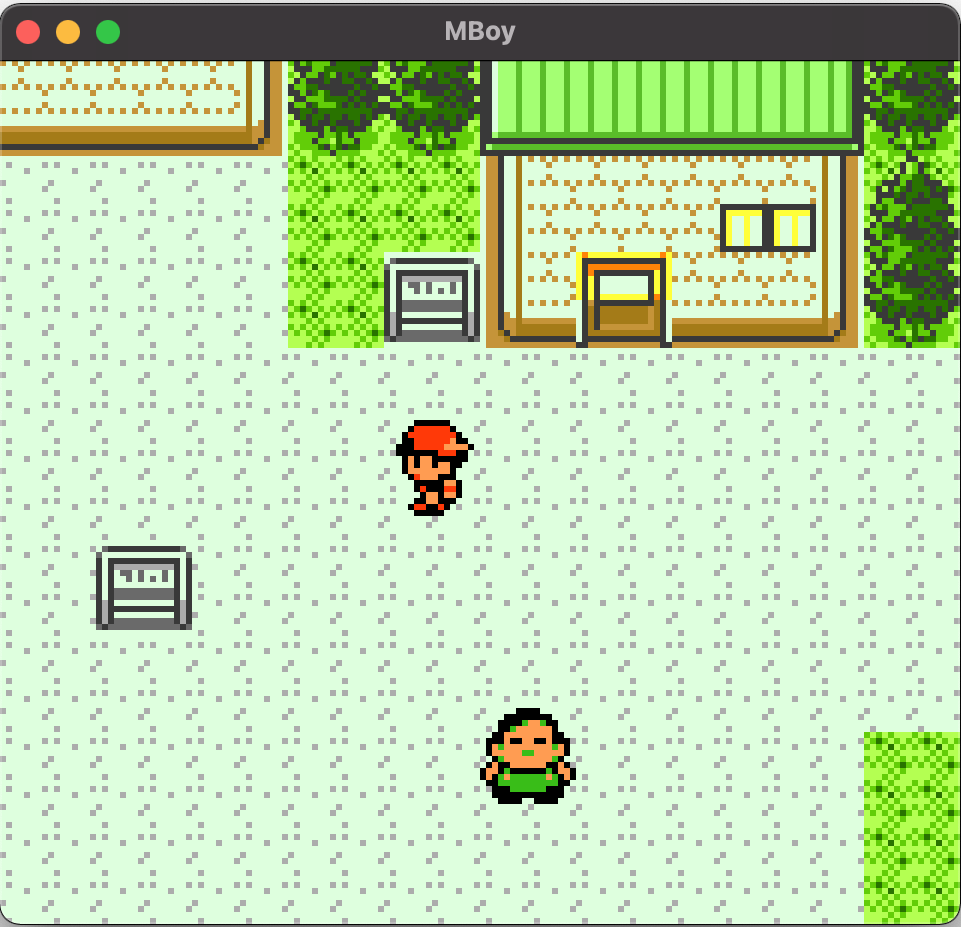
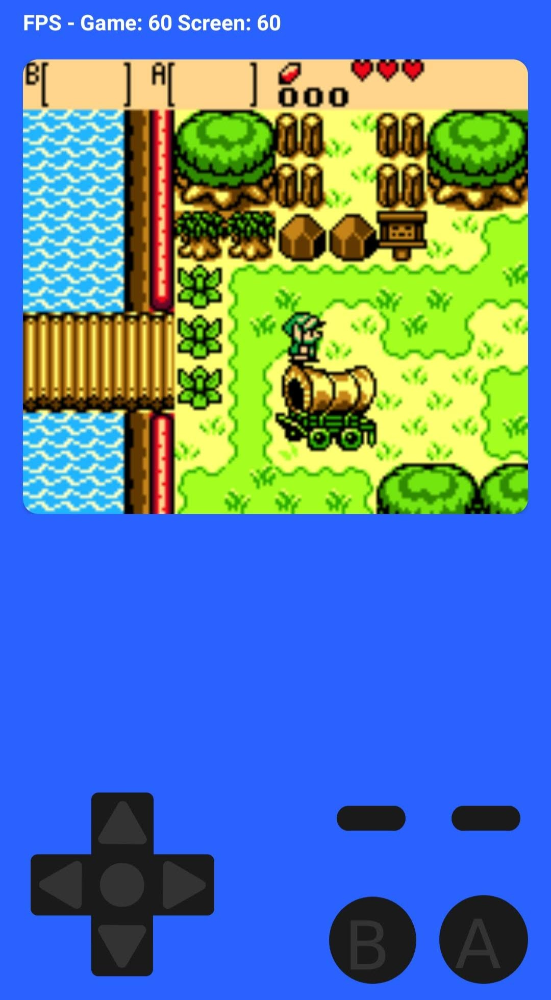

# MBoy Core
A gameboy and gameboy colour emulator written in C++ and implemented as a static library to be entirely decoupled from any GUI.

## Features
- Displays background, sprite, and window layers.
- Full audio support with square, wave, and noise channels.
- Save file support.
- Support for MBC1, MBC3, and MBC5 memory bank controllers.

## GUIs
- For a cross-platform desktop application, see [mboy-desktop](https://github.com/matthewwalsh0/mboy-desktop).
- For an Android mobile application, see [mboy-android](https://github.com/matthewwalsh0/mboy-android).

## Screenshots
### Desktop

### Android

